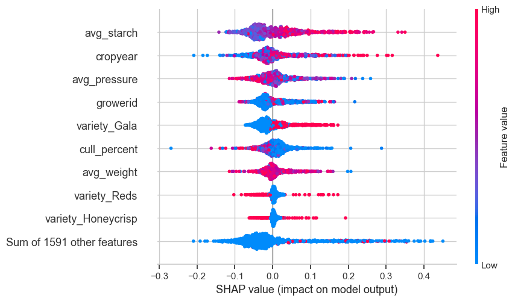
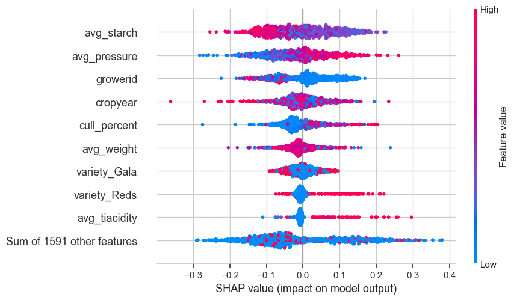
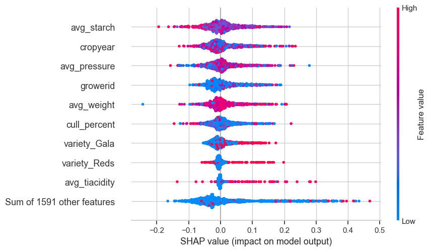

# Berkely_Capstone
## Pool Accuracy
With in this Jupyter Notebook, [main.ipynb](./main_final.ipynb), you will find steps that I have used to try to determine attributes that allow me to predict what pool a set of bins should be set to.

The types of pools that this classifier will try to predict is REG, EARLY, MID, and LATE. This pertains to the timeframe throughout the year that the Apples will be packed on a production line. An apple with good QC scores has the ability to withstand a controlled atmospheric room for up to 12 months to then be sent to a grocery store to be eaten by consumers.

## Analysis
The first step in the process is to make sure that we understand the data as much as possible and use various techniques to clean it and shape it into a format so that it is usable for predictions.

The first step for me was to clean up some of the null values that were within my dataset. Not all records within the set had QC records within them, however I knew which pool they got assigned to due to our packing records so I went ahead and took the averages of those pools and assigned that to those values. This is a tiered approach where I want to get as close using historical information and work down towards a more generic average.

```python
df['avg_size'] = df.groupby(['pool', 'growerid', 'variety'])['avg_size'].transform(lambda x: x.fillna(x.mean()))
df['avg_size'] = df.groupby(['pool', 'growerid'])['avg_size'].transform(lambda x: x.fillna(x.mean()))
df['avg_size'] = df.groupby('pool')['avg_size'].transform(lambda x: x.fillna(x.mean()))

df['avg_temp'] = df.groupby(['pool', 'growerid', 'variety'])['avg_temp'].transform(lambda x: x.fillna(x.mean()))
df['avg_temp'] = df.groupby(['pool', 'growerid'])['avg_temp'].transform(lambda x: x.fillna(x.mean()))
df['avg_temp'] = df.groupby('pool')['avg_temp'].transform(lambda x: x.fillna(x.mean()))
```

This is just a sample of 2 of the qc tests that we do but if you look at the notebook it will show you the full set of qc tests that this is done on.

## Preparation
To further prep the data for the models I compiled a definition of encoding and scaling the data so that it has the proper format to run through models. This definition will also go ahead and split away your X and y values that you will use for training and testing purposes.

```python
label_encoder = LabelEncoder()
def encode(df):
    # Encode the target column 'y'
    y = label_encoder.fit_transform(df['pool'])
    X = df.drop(columns=['pool'], axis=1)

    # Encode all categorical columns
    categorical_columns = X.select_dtypes(include=['object']).columns
    numerical_columns = X.select_dtypes(include=['number']).columns

    # Encode categorical columns
    X = pd.get_dummies(X, columns=categorical_columns, drop_first=True)

    # Encode numerical columns
    scaler = StandardScaler()
    X[numerical_columns] = scaler.fit_transform(X[numerical_columns])
    return X, y
```

You will also find that we have went ahead and added weights to a certain class and that is the 'REG' class. The reason for this is that some of the REG pool means that it won't actually get stored in a CA room and some of the say whether a fruit goes to REG or not is based on industry pricing and whether the grower wishes to pack right away.
```python
# Assign and define class weights
class_weights = {3: 0.5,  # REG gets a lower weight because we have market price influence when it comes to selecting packing right away
                 0: 1.0,
                 2: 1.0,
                 1: 1.0}
```


## Modeling
For the first phase of modeling I went through and created a DummyClassifier so that I could get a good baseline for what the data is saying as a good default threshold.

```python
dummy = DummyClassifier(strategy="most_frequent")
dummy.fit(X_train, y_train)
dummy_pred = dummy.predict(X_test)
baseline_acc = accuracy_score(y_test, dummy_pred)
```

This gave us a 31% accuracy score off the bat. This I believe is do to how the classifiers are split out within the dataset.
    ```
    pool
    REG      31.074897
    LATE     26.067719
    MID      22.511188
    EARLY    20.346196
    ```

The next stage was to run a LogisticRegression model. This though had consequences as the dataset that I have was too large to run efficiently so some adjustments had to be taken.

```python
X_trimmed = X[['cropyear', 'growerid', 'avg_size', 'avg_temp', 'avg_weight', 'avg_starch', 'avg_pressure', 'avg_split', 'avg_watercore', 'avg_frozen', 'avg_tiacidity', 'avg_lightexposure']]

# Add in all variety columns
variety_columns = [col for col in X.columns if 'variety_' in col]
X_trimmed = pd.concat([X_trimmed, X[variety_columns]], axis=1)
```

This forced me to only take into account all the QC data and then the variety columns.

You can then see the initial graph here from the run:


## Re-analysis
The next phase is to see how we can improve our accuracy against the initial testing through default models. The next approach is to try to utilize the functionality of GridSearch to loop through different parameters and determine which variation of a model will produce the greatest accuracy towards our desired result.

Through these adjustments I was able to produce roughly a 4% increase in accuracy but still well below my expectations of where it needs to be for a real world business application.

The best results were through a DT at 64% accuracy.


## Re-analysis #2

The final models that we ran through were the Random Forest Calssifier, XGBClassifier, and LGBMClassifiers to see how those would produce against the data due to its strong structured state.

This is where the models truly started to shine as within the Random Forest Classifier we were able to get to a 95% accuracy rate while having a decent precision and recall where the weakest class seems to be in the MID selections.

I then applied SHAP diagrams to show per each class what the key attributes were in determining the results. A lot of them share the same attributes but it is interesting to see how they may shift in priority.





## Summary
What we have done here is that we have been able to take into account all of our historical data from our QC process of taking an apples pressure or starch readings, push it into a RandomForestClassifier, and be able to then feed it the qc data of an apple coming directly from the orchard and get a 95% accuracy on whether that fruit should be put towards REG, EARLY, MID, or LATE rooms.

Once you have that room assignment you can then utilize the same type of idea from all of the historical packouts from that grower, lot, qc results, stored room, and predict what the packout % will be. When it comes to the fruit industry this is a game changer in terms of knowing how your fruit will do this upcoming year so that you can make plans with sales desks to sell that fruit and make other deals with processing plants for the apples to make juice.

### Next Steps
The next steps on this process will be to utilize what we have here and do exactly which was mentioned above, feed this pools into a new linear regression algorithm to give us the percent of pack out, apples put into boxes, based on the amount of bins and the storage.

